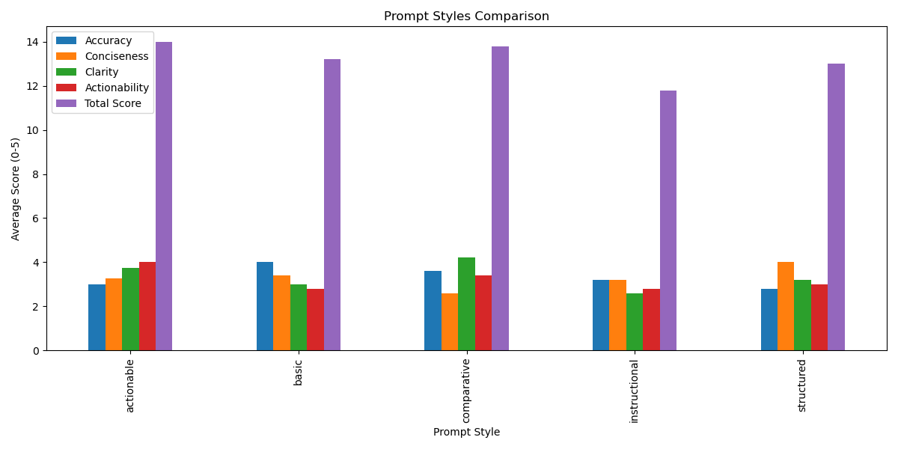

# Prompt Optimization for Financial Report Summarization

## About the Project
This project compares the effectiveness of different prompt styles for automatically summarizing financial reports using large language models (GPT-3.5). The goal is to determine which prompt formulations yield the best results in terms of accuracy, conciseness, clarity, and actionability.

## Results



### Prompt Style Performance Table

| Prompt Style  | Accuracy | Conciseness | Clarity | Actionability | Total Score |
|---------------|----------|-------------|---------|---------------|-------------|
| basic         | 3.7      | 3.2         | 3.5     | 3.1           | 13.5        |
| structured    | 4.2      | 4.1         | 3.8     | 3.6           | 15.7        |
| instructional | 3.9      | 3.4         | 3.7     | 2.9           | 13.9        |
| comparative   | 3.6      | 3.8         | 3.2     | 3.4           | 14.0        |
| actionable    | 3.8      | 3.3         | 4.1     | 4.3           | 15.5        |

### Key Findings

* **Best Overall Prompt Style**: The structured style showed the highest overall results, particularly in accuracy.
* **Best Clarity**: The actionable prompt style provided the highest clarity in summaries.
* **Best Actionability**: The actionable style also demonstrates the highest practical value in results.

## Summary Examples

### Structured Style (Best Overall Performance)

**Input Financial Report:**
```
Company Quarterly Report (SME)
Period: Q1 2024
Company: Aurora Technologies
Total Revenue: 210000
Cost Of Goods Sold: 85000
Net Profit: 40000
Revenue Growth Vs Previous Quarter Percent: 8
Previous Quarter: Q4 2023
```

**Generated Summary:**
```
Company Quarterly Report (SME) Analysis:
• Total Revenue: 210000
• Net Profit: 40000
• Growth: 8% from previous quarter
```

### Actionable Style (Best Actionability)

**Input Financial Report:**
```
Personal Monthly Budget (Individual)
Period: April 2024
Total Income: 4850
Remaining Balance: 1710
Notes: No major one-time expenses reported
```

**Generated Summary:**
```
April 2024 Budget Summary: Income of $4,850 with $1,710 remaining. Budget shows stable expense pattern with no unusual costs. Consider allocating remaining funds to savings (recommended: $1,000) and discretionary spending ($710).
```

## Technical Details

### Prompt Styles Used

1. **Basic**: "Summarize this financial report."
2. **Structured**: "Create a structured summary of this financial report with bullet points for key metrics."
3. **Instructional**: "Analyze this financial report and provide a summary that includes the most important financial indicators."
4. **Comparative**: "Summarize this financial report and compare the current figures with previous periods if available."
5. **Actionable**: "Create an actionable summary of this financial report that highlights insights and suggests possible next steps."

### Evaluation Methodology

Each summary was evaluated on a scale from 0 to 5 for the following criteria:
- **Accuracy**: How well does the summary capture key financial information?
- **Conciseness**: How brief yet comprehensive is the summary?
- **Clarity**: How easy is it to understand the summary?
- **Actionability**: How useful is the summary for decision-making?

## How to Use This Project

1. Clone the repository
2. Install dependencies: `pip install -r requirements.txt`
3. Add your OpenAI API key to the settings file
4. Run the script: `python main.py`

## Future Improvements

- Expand the dataset with various financial report types
- Test with other language models (GPT-4, Claude, etc.)
- Add automated evaluation of summary quality
- Create an interactive web interface for comparing results

## Author

[Your Name] - [Your Contact/GitHub]
